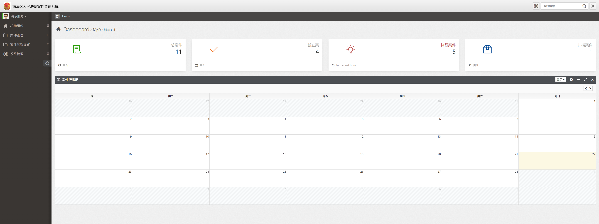

# court-property-preservation（法院财保案件查询与跟踪系统）

基于南海法院财保案件业务场景的 ASP.NET MVC 系统，覆盖案件从立案到归档的全流程管理，支持角色权限、状态流转、时限预警、查询统计、退回重提、短信通知等能力。

## 在线演示

- 演示地址：[https://preservation.blazorserver.com/](https://preservation.blazorserver.com/)
- 点击截图进入演示：

[](https://preservation.blazorserver.com/)

## 项目背景

根据 `doc/1_南海法院财保案件查询系统需求确认书V0.1-1108(1).docx` 和 `doc/1_南海法院案件二期.docx`，本系统用于解决财保案件数量大、人工跟踪难、流程监管成本高的问题，目标是在内网环境下实现可追踪、可审计、可预警的案件管理平台。

## 核心功能

- 角色与权限控制：立案人、内勤、承办人、书记员、庭室内勤等角色按职责授权。
- 案件全流程流转：立案、移交、执行、审批、办结、调取、归档等状态管理。
- 退回机制：信息有误时可退回至立案节点修改后再次流转。
- 查询与统计：按案号、年份、执行主体、原执保案号、状态等多条件检索，并导出统计结果。
- 节点时限与超期预警：按节点设置时限，对超期案件及续封续冻到期前场景进行提醒。
- 立案审批表生成：结合模板文书生成审批材料（见 `doc/立案审批表模板.doc`）。
- 二期增强需求：支持承办人/书记员变更、联系方式维护、短信模板与自动发送流程等。

## 代码结构

```text
.
├─doc/                              # 需求文档、模板、短信 API 手册等
├─src/
│  ├─clean-solution/                # 清理后的可维护版本（推荐阅读/开发）
│  ├─NCase.Solution/                # 完整业务版本（模块最全）
│  └─NCase.Solution-onlysourcecode/ # 源码归档版本
└─README.md
```

`NCase.Solution` 中可见的主要业务控制器包括：`LegalCases`、`TrackHistories`、`NodeTimes`、`NodeConfigs`、`TempCaseIds`、`RoleMenus`、`Attachments` 等，覆盖案件处理、节点配置、日志跟踪与权限管理。

## 技术栈

- 框架：ASP.NET MVC 5 + ASP.NET Web API（.NET Framework 4.8）
- ORM：Entity Framework 6
- 身份认证：ASP.NET Identity + OWIN
- 实时通信：SignalR
- 后台任务：Hangfire（SQL Server 存储）
- 文档与接口：Swashbuckle（Swagger）
- 日志：NLog
- 前端：Bootstrap、jQuery、EasyUI（项目内静态资源）
- 数据库：SQL Server / LocalDB（默认连接字符串为 `DefaultConnection`）

## 快速开始（本地）

### 1. 环境准备

- Visual Studio 2019/2022（含 .NET Framework 4.8 开发组件）
- SQL Server 或 LocalDB
- IIS Express（VS 自带）

### 2. 打开解决方案

推荐先使用：

- `src/clean-solution/NCase.Solution.sln`

需要完整业务模块时使用：

- `src/NCase.Solution/NCase.Solution.sln`

### 3. 还原依赖并编译

在 Visual Studio 中执行 NuGet Restore，然后编译解决方案。

### 4. 配置数据库连接

编辑 `src/clean-solution/WebApp/Web.config`（或对应方案下同路径）的 `DefaultConnection`：

```xml
<add name="DefaultConnection"
     connectionString="Data Source=(LocalDb)\MSSQLLocalDB; Initial Catalog=ncasedb;Integrated Security=True;MultipleActiveResultSets=True;App=EntityFramework"
     providerName="System.Data.SqlClient" />
```

### 5. 初始化数据库

项目集成了 EF 迁移管理页面（`EFMigrationsManager`）。首次启动后可通过页面执行迁移发布，或使用常规 EF Migrations 命令初始化数据库。

### 6. 运行

直接使用 IIS Express 启动 `WebApp` 项目。默认工程配置中曾使用本地地址 `http://localhost:5100/`。

## 文档清单（doc）

- `doc/1_南海法院财保案件查询系统需求确认书V0.1-1108(1).docx`：一期需求、角色权限、流程、节点预警、部署建议。
- `doc/1_南海法院案件二期.docx`：二期需求（编辑增强、短信模板、自动发送触发点、性能优化）。
- `doc/解封续封程序需求/解封续封程序.doc`：解封续封相关业务说明。
- `doc/移动代理服务器 MAS 短信 API2.2 开发手册.pdf`：短信网关对接文档。
- `doc/立案审批表模板.doc` / `doc/解封续封程序需求/立案审批表模板.docx`：立案审批表模板。

## 注意事项

- 仓库包含多套历史版本，开发前请先统一以一个方案为主，避免配置漂移。
- 文档涉及法院业务字段与流程，请在内网/测试环境验证后再发布。
- 涉及短信发送时，请先替换测试密钥与网关配置，再进行联调。

## License

本仓库采用 MIT License，详见 `LICENSE`。
